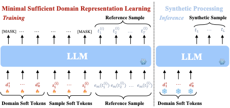

# DOMINO: Domain-Specific Data Synthesis for LLMs via Minimal Sufficient Representation Learning

DOMINO learns a **minimal sufficient representation** of a target domain from limited reference examples via soft prompt tuning and contrastive learning.

## Method Overview

DOMINO trains two types of learnable continuous soft tokens:

- **Domain-level soft tokens** $\mD^*$: Shared across all reference samples, capturing generalizable domain patterns.
- **Sample-level soft tokens** $\mS^{(i)}$: Unique per sample, encoding sample-specific information.

The training objective consists of two terms:

**1. Domain-level likelihood** (Eq 1 in paper):
\[
\mathcal{L}_1 = -\frac{1}{n} \sum_{i=1}^n \log p(\mX^{(i)}|\mD)
\]
Maximizes the likelihood of all reference data given domain-level soft tokens only, learning a sufficient representation for the domain.

**2. Contrastive loss** (Eq 2 in paper):
\[
\mathcal{L}_2 = -\frac{1}{n} \sum_{i=1}^n \log \frac{p(\mX^{(i)}|\mD^*,\mS^{(i)})}{\sum_{j\neq i} p(\mX^{(j)}|\mD^*,\mS^{(i)})}
\]
The numerator ensures $\mD^*$ and $\mS^{(i)}$ together reconstruct $\mX^{(i)}$. The denominator penalizes using $\mS^{(i)}$ to reconstruct other samples $\mX^{(j)}$, forcing $\mD^*$ to focus on shared domain knowledge while $\mS^{(i)}$ handles sample-specific details.

**Final loss** (Eq 3 in paper):
\[
\mathcal{L} = \mathcal{L}_1 + \lambda \mathcal{L}_2
\]

After training, only $\mD^*$ is used for data synthesis, generating diverse in-domain samples that generalize beyond the reference set.

Refer to Section~\ref{sec:method} of the paper for theoretical justifications, including proofs that $\mathcal{L}_2$ maximizes $I(\mS^{(i)};\mX^{(i)}|\mD^*)$ and minimizes $I(\mS^{(i)};\mD^*)$, and that the learned $\mD^*$ achieves minimal sufficient representation.



## Directory Structure

```
DOMINO/
├── domino/
│   ├── contrastive/           # Core method: public+private soft token contrastive learning
│   │   ├── model.py           # PublicPrivateContrastiveModel
│   │   ├── train.py           # Training script (HuggingFace Trainer)
│   │   ├── dataset.py         # Dataset loader
│   │   └── generate.py        # Synthetic data generation (transformers/vLLM)
│   │
│   ├── soft_prompt/           # Baseline: shared public soft prompt tuning
│   │   ├── model.py, train.py, dataset.py, generate.py
│   │
│   ├── pipeline/              # Synthetic data quality control pipeline
│   │   ├── code_generation/   # Quality assessment, response generation, filtering
│   │   └── code_execution/    # Quality assessment, response generation, correctness check
│   │
│   ├── evaluation/            # LiveCodeBench evaluation harness
│   │   ├── code_generation/   # Pass@k computation, sandboxed testing
│   │   └── code_execution/    # Execution correctness, metrics
│   │
│   └── utils/                 # Embedding extraction, statistics, LLM query
│
├── scripts/                   # Example training and pipeline scripts
├── configs/                   # DeepSpeed ZeRO configurations
└── examples/                  # Visualization and analysis scripts
```

## Requirements

- Python 3.10+
- PyTorch 2.0+
- transformers
- vLLM
- DeepSpeed
- tree-sitter + tree-sitter-python
- scikit-learn, matplotlib, numpy, scipy
- pyext (for code generation evaluation)

Install dependencies:
```bash
pip install torch transformers vllm deepspeed tree-sitter tree-sitter-python scikit-learn matplotlib numpy scipy pyext datasets
```

## Quick Start

### Step 1: Prepare Reference Data

Prepare your reference dataset in JSONL format:
```jsonl
{"question_content": "Write a function to ...", ...}
```

### Step 2: Train DOMINO Soft Tokens

```bash
cd scripts
bash train_contrastive.sh
```

This trains public and private soft tokens via contrastive learning on the reference dataset.

### Step 3: Generate Synthetic Data

```bash
bash pipeline_codegen.sh
```

This generates synthetic code problems, filters by quality, and produces instruction-response pairs.

### Step 4: (Optional) SFT with Synthetic Data

Use the generated instruction-response pairs to fine-tune a base LLM using your preferred framework (e.g., LLaMA-Factory).

### Step 5: Evaluate

```bash
python -m domino.evaluation.code_generation.evaluate \
    --data_path ./data/test.jsonl \
    --model_path ./path/to/your/model
```

<!-- ## Citation

```
@software{domino2025,
  title={DOMINO: Domain-level \& Sample-level Contrastive Soft Prompt Tuning for Code Generation},
  author={Your Name},
  year={2025},
  url={https://github.com/yourusername/DOMINO}
}
``` -->

## License

Apache 2.0
